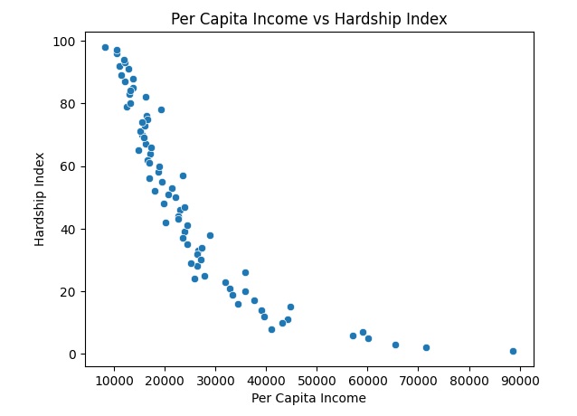
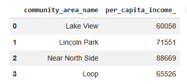

# SQL + Python Data Analysis (Real-World Dataset)

This project demonstrates how to use SQL and Python together to analyze a real-world dataset.

---

## Project Overview

In this project, I analyzed a Chicago socioeconomic dataset to explore patterns in income and hardship across community areas.

The workflow combines:
- SQLite for data storage
- SQL for querying and analysis
- Python (Pandas & Seaborn) for data transformation and visualization

---

## Tools & Technologies

- Python (Pandas, Seaborn, Matplotlib)
- SQLite
- SQL (executed via Python)
- Google Colab

---

## Project Files

- `03_SQL_RealWorld_Data_Analysis.ipynb`  
  → Real-world dataset analysis using SQL and Python

---

## Key Analysis

- Counted total community areas in the dataset
- Identified areas with high hardship index
- Found the maximum hardship level and the most affected area
- Identified community areas with high per capita income
- Explored the relationship between income and hardship

---

## Visualization

### Income vs Hardship Index

The chart shows a clear inverse relationship between per capita income and hardship index. Community areas with higher income levels tend to experience lower socioeconomic hardship.

---

## Example Query Result

This query identifies the highest-income community areas in the dataset.

---

## Key Insight

There is a strong inverse relationship between income and hardship. As income increases, hardship levels tend to decrease across community areas.

---

## What I Learned

- How to combine SQL and Python in a single workflow
- How to query and analyze structured data using SQL
- How to clean and standardize real-world datasets
- How to visualize and interpret data patterns

---

## 🔗 Next Steps

I plan to continue building data analysis projects using real-world datasets and expand into dashboards and data storytelling.
